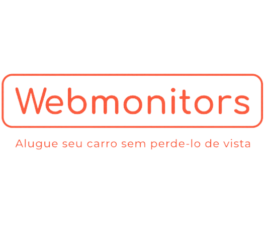

# Challenge Webmotors 2022 - Fiap
## Projeto CoudIt

## Objetivo

Desenvolvimento de uma solução para mobilidade urbana. Sendo assim a equipe CloudIt irá desenvolver um site para:

- Venda
- Compra
- Locação

Além disso nosso projeto irá contar com um sistema de monitoramento do veículo e uma case para a chave do proprietário que será liberado após a aprovação do pagamento.

## Desenvolvimento

#### Etapas de desenvolvimento

- Desenvolvimento do sistema de monitoramento
- Desenvolvimento do sistema de case de segurança
- Criação do site da webmonitors
- Integração do site com os provedores de cloud (GCP e AWS)
- Implementação do back-end

#### Etapa 1

**Desenvolvimento do sistema de monitoramento**

Nesta etapa desenvolvemos o sistema de monitoramento utiizando tecnologias iot (internet of things). Para isso utilizamos os seguintes componentes:

- **Preencher com os componentes utilizados** --> LEMBRAR

**Colocar foto do desenho de arq do iot e a foto do dispositivo montado** --> LEMBRAR

#### Etapa 2

**Desenvolvimento do sistema de case de segurança**

Nesta etapa desenvolvemos o sistema de segurança para a chave do usuário utilizando tecnologias iot (internet of things). Para isso utilizamos os seguintes componentes:

- Arduino Uno
- Servo motor
- Teclado matricial 4x4
- Ferrolho
- Caixa 3D

Ao usuário efetuar o pagamento ele irá receber um código no app e irá utilizar este código para desbloquear a caixa com a chave. Ao digitar a senha correta o servo motor irá girar puxando o ferrolho da caixa e liberando o acesso.

**Colocar foto do dispositivo montado** --> LEMBRAR 

#### Etapa 3

**Criação do site da webmonitors**

Nesta etapa desenvolvemos o front-end do nosso site em HTML, CSS, NodeJS e Python que se encontra dentro da pasta **frontend**.

#### Etapa 4

**Desenho de arquitetura e integração do site com os provedores de cloud (GCP e AWS)**

Nesta etapa desenvolvemos o desenho de arquitetura na GCP e AWS que se encontra dentro da pasta **arquitetura**.

#### Etapa 5

**Implementação do back-end**

Ir colocando os passos de desenvolvimento do nosso back-end
